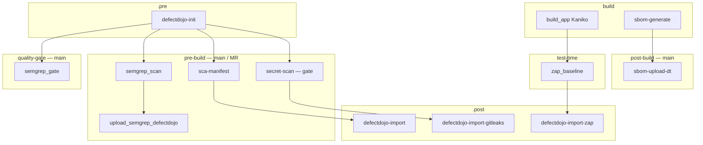
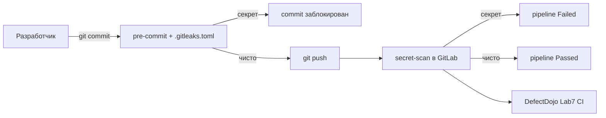

# Портфолио курса «Разработка защищённого ПО»

**Студент:** Трюх Екатерина Александровна · **Группа:** М09КИИ-25  
**Практический объект:** [OWASP Juice Shop](https://github.com/juice-shop/juice-shop) **17.0.0** (`juice-shop/`)  
**Период практики:** 19–21.05.2026 · **Репозиторий курса (GitLab):** http://10.0.0.10/root/juice-shop-lab

> Этот документ — **сводка для рекрутера и технического интервьюера**: что сделано по курсу, какими инструментами, какие метрики и артефакты подтверждают навыки. Детальные отчёты с командами и скриншотами — в `Done/lab_report_*.md` и `lab_report_7.md`.

---

## Содержание

1. [Краткое резюме](#краткое-резюме-для-рекрутера)
2. [Матрица компетенций](#матрица-компетенций)
3. [Хронология курса](#хронология-курса)
4. [Сквозной DevSecOps pipeline](#сквозной-devsecops-pipeline)
5. [Инфраструктура курса](#инфраструктура-курса)
6. [Лабораторная работа №1 — Attack Surface](#лабораторная-работа-1--инвентаризация-поверхности-атаки)
7. [Лабораторная работа №3 — Component VM](#лабораторная-работа-3--управление-уязвимостями-компонентов)
8. [Лабораторная работа №4 — SCA / SBOM](#лабораторная-работа-4--sca--sbom)
9. [Лабораторная работа №5 — SAST / Semgrep](#лабораторная-работа-5--sast--semgrep)
10. [Лабораторная работа №6 — DAST / OWASP ZAP](#лабораторная-работа-6--dast--owasp-zap)
11. [Лабораторная работа №7 — Secret scanning](#лабораторная-работа-7--поиск-и-блокировка-секретов)
12. [Ключевые артефакты в репозитории](#ключевые-артефакты-в-репозитории)
13. [Portfolio highlights](#portfolio-highlights-готовность-к-роли)
14. [Заключение и развитие](#заключение-и-дальнейшее-развитие)

> **Примечание:** лабораторная работа **№2** в репозитории **не представлена** (нет отчёта и артефактов). Нумерация курса: **1 → 3 → 4 → 5 → 6 → 7**.

---

## Краткое резюме (для рекрутера)

На протяжении курса пройден **полный цикл DevSecOps** на одном учебном приложении — намеренно уязвимом OWASP Juice Shop:

| Этап SSDLC | Что сделано | Инструменты |
|------------|-------------|-------------|
| Понимание приложения | Инвентаризация архитектуры, API, Docker-экспозиции | Docker, DevTools, `server.ts`, Swagger |
| Управление уязвимостями (ручное) | Реестр CVE/GHSA компонентов, triage | NVD, GHSA, DefectDojo UI |
| Supply chain (SCA) | SBOM CycloneDX, мониторинг зависимостей | Trivy, Dependency-Track, npm audit, GitLab CI |
| Статический анализ (SAST) | ≥16 правил Semgrep, triage TP/FP, Quality Gate | Semgrep 1.95.0, SARIF, DefectDojo |
| Динамический анализ (DAST) | Эксплуатация SQLi и BOLA, патчи, проверка «до/после» | curl, OWASP ZAP, Kaniko, GitLab CI |
| Secret management | Pre-commit + CI Security Gate, allowlist CTF-секретов | Gitleaks 8.18.4, pre-commit |

**Итог для найма:** умею не только «запускать сканер», а выстраивать **цепочку**: от инвентаризации → ручной/автоматический анализ → триаж → исправление кода → повторная проверка → автоматизация в CI с централизованным учётом в **DefectDojo**.

---

## Матрица компетенций

| Категория | Навык | Инструмент / стандарт | Лаба | Подтверждение |
|-----------|-------|----------------------|------|---------------|
| **AppSec / Recon** | Attack Surface Inventory, trust boundaries | OWASP WSTG, Docker | №1 | `Done/lab_report_1.md` |
| **Vulnerability Management** | Ручной CVE/GHSA, применимость, severity | NVD, GHSA, CWE | №3 | 7 findings в DefectDojo |
| **SCA / SBOM** | CycloneDX, transitive deps, приоритизация | Trivy, Dependency-Track, npm audit | №4 | SBOM 1960 comp., DT 28, audit 86 |
| **CI/CD** | GitLab pipeline, artifacts, registry | Kaniko, `shared` runner | №4–7 | Pipelines #37, #44, #59, #63–74 |
| **VM platform** | Product/Engagement/Test, import scans | DefectDojo API/UI | №3–7 | Engagements Lab3–Lab7 |
| **SAST** | Custom rules, triage, precision tuning | Semgrep, `.semgrepignore` | №5 | 16 rules, Precision 36%→60% |
| **DAST** | Black-box testing, exploit verification, patches | curl, OWASP ZAP baseline | №6 | SQLi + BOLA, pipeline #59 |
| **Secrets** | Shift-left gates, allowlist policy | Gitleaks, pre-commit | №7 | MR gate Failed/Passed |
| **Secure coding** | Parameterized queries, authZ на ресурсах | TypeScript/Express | №6 | `routes/search.ts`, `routes/basket.ts` |
| **Standards** | OWASP Top 10 (2025), CWE-89, CWE-639, CWE-798 | Отчёты, правила | №5–7 | Таблицы в отчётах |

---

## Хронология курса

| Дата | Лаба | Ключевое событие | Pipeline / артефакт |
|------|------|------------------|---------------------|
| *(ранее)* | №1 | Docker + inventory Juice Shop | `Done/lab_report_1.md` |
| 19.05.2026 | №3 | Ручной реестр CVE → DefectDojo | 7 findings, `Done/findings.json` |
| 19–20.05.2026 | №4 | Trivy SBOM → DT; npm audit; CI | **#37** Passed (5/5 jobs), 195 findings в DD |
| 20.05.2026 | №5 | Semgrep SAST + Quality Gate | **#44** Passed, 45 findings в DD |
| 20–21.05.2026 | №6 | Ручной DAST + патчи + ZAP CI | **#59** Passed (7 stages) |
| 21.05.2026 | №7 | Gitleaks pre-commit + Security Gate | **#63**, **#70** Passed; **#73** Failed; **#74** Passed (MR) |

---

## Сквозной DevSecOps pipeline

Все автоматизированные проверки (лабы **4–7**) собраны в одном файле `juice-shop/.gitlab-ci.yml`.



> **Снимки pipeline #37 / #44 / #59** — исторические прогоны на этапе сдачи соответствующих лаб (в отчётах: 5, 8 и 7 jobs/stages). Текущий `main` в `.gitlab-ci.yml` объединяет **все** проверки лаб 4–7 (~12 jobs).  
> **DefectDojo:** при сдаче лаб 4–6 engagements назывались `Lab4 CI 37`, `Lab5 CI 44`, `Lab6 CI 59`. С лабы 7 `defectdojo-init` создаёт engagement **`Lab7 CI <pipeline_id>`** для каждого прогона.

### Стадии GitLab CI и привязка к лабам

| Stage | Job | Инструмент | Лаба | Когда запускается |
|-------|-----|------------|------|-------------------|
| `.pre` | `defectdojo-init` | DefectDojo API | 4–7 | MR, `main`, schedule, ZAP full |
| `pre-build` | `secret-scan` | Gitleaks 8.18.4 | 7 | MR + `main`; **падает pipeline** при секрете |
| `pre-build` | `sca-manifest` | npm audit → JSON | 4 | `main` |
| `pre-build` | `semgrep_scan` | Semgrep 1.95.0 | 5 | `main` |
| `pre-build` | `upload_semgrep_defectdojo` | DefectDojo reimport | 5 | `main` |
| `build` | `build_app` | Kaniko → `10.0.0.11:5000` | 6 | MR + `main` + schedule |
| `build` | `sbom-generate` | Trivy → CycloneDX | 4 | `main` |
| `test-time` | `zap_baseline` | OWASP ZAP | 6 | MR + `main` |
| `test-time` | `zap_full_scan` | OWASP ZAP full | 6 | schedule / `RUN_ZAP_FULL=true` |
| `post-build` | `sbom-upload-dt` | Dependency-Track API | 4 | `main` |
| `quality-gate` | `semgrep_gate` | порог ERROR ≤ 15 | 5 | `main` |
| `.post` | `defectdojo-import` | npm audit → DD | 4 | `main` |
| `.post` | `defectdojo-import-gitleaks` | Gitleaks → DD | 7 | MR + `main` |
| `.post` | `defectdojo-import-zap` | ZAP → DD | 6 | MR + `main` |

**Workflow rules (Lab 7):** pipeline на ветках-кандидатах ограничен — MR, `main`, schedule и `RUN_ZAP_FULL`; лишние push-пайплайны отключены (меньше «cancel storm»). На **MR** не запускаются `semgrep_scan`, `sca-manifest`, `sbom-generate` — только secret-scan, build, ZAP и импорты.

---

## Инфраструктура курса

| Сервис | URL | Назначение |
|--------|-----|------------|
| **GitLab** | http://10.0.0.10/root/juice-shop-lab | Код, CI/CD, MR, Security Gate |
| **DefectDojo** | http://10.0.0.20:8080 | Единый реестр findings (Product: OWASP Juice Shop) |
| **Dependency-Track** | http://10.0.0.30:8080 (UI), :8081 (API) | SCA по SBOM, Vulnerability Analysis |
| **Container registry** | 10.0.0.11:5000 | Образы Trivy, Semgrep, ZAP, Gitleaks, app |
| **GitLab Runner** | tag `shared` (VM-101) | Выполнение jobs |
| **Upstream** | https://github.com/juice-shop/juice-shop | Эталонное приложение |

---

## Лабораторная работа №1 — Инвентаризация поверхности атаки

**Отчёт:** `Done/lab_report_1.md` · **Методичка:** `Done/Лабораторная работа №1..md`

> В файле `Done/lab_report_1.md` шапка ещё с плейсхолдерами (`<ФИО>`, дата); содержание инвентаризации и выводы перенесены в эту сводку. ФИО и группа — из лаб 3–7.

### Цель

Зафиксировать **поверхность атаки** учебного приложения **без эксплуатации** и без сканеров — только архитектура, конфигурация и наблюдаемое поведение (OWASP Attack Surface Analysis / WSTG-инвентаризация).

### Что сделано (по шагам)

1. **Развёртывание** Juice Shop в Docker (`bkimminich/juice-shop`, порт 3000, варианты `127.0.0.1` vs `0.0.0.0`).
2. **Анализ документации:** README, `Dockerfile` (Node 20, distroless, `EXPOSE 3000`), `docker-compose.test.yml`.
3. **Архитектура:** Angular SPA + Express/Node.js 20 + SQLite/Sequelize в **одном контейнере**.
4. **Сеть:** TCP/HTTP :3000, отсутствие внешнего порта БД; диагностика `docker ps`, `docker port`, `netstat`.
5. **API inventory** из `server.ts` и `swagger.yml` (`/rest/user/login`, `/rest/products/search`, `/api/Users`, `/rest/basket/:id`, B2B `/b2b/v2`, …).
6. **Клиентская поверхность:** DevTools Network/Application (токены, storage).
7. **Конфигурация** по именам параметров в `config/default.yml` / `config.schema.yml` (без значений секретов).
8. **Границы scope** и trust boundaries для последующих лаб.

### Результаты (сжато)

| Область | Вывод |
|---------|--------|
| Компоненты | SPA (Angular) + API (Express) + SQLite in-process |
| Экспозиция | Зависит от `docker run -p`; типовой стенд — localhost |
| Поверхность | HTTP API + статика + клиентское хранилище + конфиги |
| CVE | **Вне scope** лабы 1 (только inventory) |

### Навыки для резюме

- Attack Surface Mapping, asset inventory  
- Docker security basics (port binding, distroless)  
- REST API enumeration, reading OpenAPI/Swagger  
- Подготовка данных для SCA/DAST без «слепого» сканирования  

### Что это даёт работодателю

Перед автоматизацией (SCA/SAST/DAST) показано умение **понять систему**: где входы, где доверие, что в scope — база для осмысленного triage, а не «красный отчёт ради отчёта».

---

## Лабораторная работа №3 — Управление уязвимостями компонентов

**Отчёт:** `Done/lab_report_3.md` · **Импорт:** `Done/findings.json` · **Дата:** 19.05.2026

### Цель

Построить **ручной реестр** уязвимостей third-party компонентов Juice Shop 17.0.0: версии → NVD/GHSA → применимость → учёт в **DefectDojo** (без CI — по методичке).

### Что сделано (по шагам)

1. Связь с лабой №1 (тот же объект, те же API и стенд `127.0.0.1:3000`).
2. Инвентаризация компонентов из **≥5 источников:** `package.json`, `Dockerfile`, `frontend/package.json`, факты лабы 1, `docker exec` в distroless-образе (`/nodejs/bin/node`).
3. Таблица компонентов (express, sequelize, jsonwebtoken, sanitize-html, socket.io, libxmljs2, Angular, образ Docker, …).
4. **Ручной поиск** CVE/GHSA с оценкой exploitability на учебном стенде.
5. Структура в DefectDojo: Product **OWASP Juice Shop** → Engagement **Lab3** → import Generic Findings.
6. Метрики после импорта: **7 findings** (1 Critical, 5 High, 1 Medium).

### Примеры находок (из отчёта)

| Компонент | Тема | Связь с приложением |
|-----------|------|---------------------|
| jsonwebtoken | Устаревшая версия, известные advisory | JWT `/rest/user/login` |
| sanitize-html | XSS-sanitizer bypass истории | Обработка пользовательского HTML |
| vm2 / транзитивы | RCE в sandbox-контекстах | Цепочка зависимостей |
| Образ / Node | Supply chain поверхность | Dockerfile, distroless |

### Навыки для резюме

- Manual vulnerability research (NVD, GHSA)  
- Component inventory в npm/Docker/distroless  
- DefectDojo: Product → Engagement → Test → Findings  
- Risk assessment: severity + **применимость** к конкретному деплою  

### Связь с лабой №4

Лаба 3 — **ручной** процесс (7 findings). Лаба 4 — **автоматический SCA** (SBOM, 28–86+ findings): те же компоненты, другой масштаб и непрерывность.

---

## Лабораторная работа №4 — SCA / SBOM

**Отчёт:** `Done/lab_report_4.md` · **Оценка:** 4 балла (база + 2 доп.) · **Даты:** 19–20.05.2026

### Цель

Автоматизировать **композиционный анализ**: SBOM → Dependency-Track → сравнение с `npm audit` → GitLab CI → DefectDojo.

### Что сделано (по шагам)

1. Подготовка `package-lock.json`, фиксация commit `86bc7dc4` (`.sca_commit`).
2. **Trivy SBOM (fs):** CycloneDX, **1960** компонентов → `juice-shop/sbom.cdx.json`.
3. **Trivy SBOM (image):** **905** компонентов → `sbom-image.cdx.json`.
4. **Dependency-Track:** проект, загрузка BOM (UI + API), **1673** проиндексированных компонентов.
5. **Vulnerability Analysis** (20.05.2026): **28 findings** (GHSA, analyzer GITHUB) — в т.ч. vm2@3.9.17.
6. **`npm audit`:** **86** уязвимостей (14 critical) — более полный manifest-based охват.
7. Сопоставление с лабой №3 (jsonwebtoken, sanitize-html, vm2, …).
8. **GitLab CI pipeline #37:** 5/5 jobs Passed; Engagement **Lab4 CI 37**, **195** findings (NPM Audit Scan).

### Метрики (итоговая таблица)

| Этап | Метрика | Результат |
|------|---------|-----------|
| SBOM (Trivy fs) | Компонентов | **1960** |
| SBOM (Trivy image) | Компонентов | **905** |
| Dependency-Track | Проиндексировано | **1673** |
| Dependency-Track | Findings (GHSA) | **28** (15 crit, 3 high, 9 med, 1 low) |
| npm audit | Уязвимостей | **86** (14 critical) |
| GitLab CI | Pipeline | **#37** Passed |
| DefectDojo | Import | **195** findings |

> **195 vs 86:** `npm audit` видит **86** advisory; DefectDojo после импорта (v2→v1 конвертация, разбиение по пакетам) — **195** findings. Это не противоречие, см. `Done/lab_report_4.md` §5.6.

### Навыки для резюме

- SBOM generation (CycloneDX), Trivy  
- Dependency-Track (UI + REST API, `processing:false`)  
- npm audit, приоритизация по severity  
- GitLab CI: secrets/variables, artifacts, multi-job pipeline  
- Понимание ограничений analyzer (DT GHSA vs полный npm audit)  

### Что это даёт работодателю

Умение закрыть **Software Supply Chain Security (OWASP A03)**: не только «есть уязвимости», а **измеримый** процесс с SBOM, платформой и CI-импортом в VM.

---

## Лабораторная работа №5 — SAST / Semgrep

**Отчёт:** `Done/lab_report_5.md` · **Конфиг:** `juice-shop/semgrep/` · **Pipeline:** **#44** · **Дата:** 20.05.2026

### Цель

Настроить **статический анализ** собственного кода Juice Shop: правила → прогон до/после → triage → CI + DefectDojo + Quality Gate.

### Что сделано (по шагам)

1. Анализ стека: TypeScript backend (Express, Sequelize), Angular 15 frontend, JWT, опасные зоны (`routes/`, `lib/`, `frontend/src/`).
2. Каталог `semgrep/rules/`: **≥16 custom rules** (language / owasp / stack / custom).
3. `.semgrepignore` — снижение шума (tests, codefixes, `node_modules`).
4. Локальные прогоны **до/после** → `semgrep/reports/report-before.*`, `report-after.*` (JSON + SARIF).
5. **Триаж:** таблицы TP (5) и FP (4); Precision **~36% → ~60%**.
6. **GitLab CI #44:** `semgrep_scan`, `upload_semgrep_defectdojo`, `semgrep_gate` (ERROR ≤ 15).
7. DefectDojo: **Lab5 CI 44** → **45 findings** (High 7, Medium 35, Low 3).

### Классы уязвимостей (примеры TP)

| Паттерн | OWASP | CWE | Файл |
|---------|-------|-----|------|
| SQL через конкатенацию / template literal | A05 Injection | CWE-89 | `routes/search.ts` |
| `eval()` | A05 Injection | — | `routes/captcha.ts`, `userProfile.ts` |
| MD5 для паролей | A04 Crypto | — | `lib/insecurity.ts` |
| Hardcoded JWT private key | A04 / A07 | — | `lib/insecurity.ts` |
| `innerHTML` | XSS | — | `frontend/...` |

### Навыки для резюме

- Semgrep rule authoring (regex + taint)  
- SAST triage: TP / FP / suppressions  
- SARIF, отчёты для DefectDojo (`Semgrep JSON Report`)  
- Quality Gate design (пороги с обоснованием)  
- Разделение **SCA vs SAST** (зависимости vs исходники)  

### Связь с лабой №6

Semgrep дал **гипотезы** (CWE-89 в `search.ts`, CWE-639 в `basket.ts`); лаба 6 **подтвердила** их динамически и **исправила** в коде.

---

## Лабораторная работа №6 — DAST / OWASP ZAP

**Отчёт:** `Done/lab_report_6.md` · **Патчи:** `juice-shop/lab6/` · **Pipeline:** **#59** · **Даты:** 20–21.05.2026

### Цель

Освоить **ручной DAST** (black-box), устранить две уязвимости разных классов OWASP, проверить «до/после», автоматизировать **OWASP ZAP** в CI.

### Выбранные уязвимости

| № | Уязвимость | OWASP 2025 | CWE | Endpoint |
|---|------------|------------|-----|----------|
| 1 | SQL Injection (поиск) | A05 Injection | CWE-89 | `GET /rest/products/search?q=` |
| 2 | BOLA / IDOR (корзина) | A01 Broken Access Control | CWE-639 | `GET /rest/basket/:id` |

### Что сделано (по шагам)

1. Стенд «**до**»: `http://127.0.0.1:3000` (`bkimminich/juice-shop:v17.0.0`).
2. **Эксплуатация SQLi** — доказательство утечки данных `Users` (curl, воспроизводимые логи).
3. **Эксплуатация BOLA** — доступ к чужой корзине при валидном JWT.
4. **Патчи:** `routes/search.ts` (параметризованный запрос), `routes/basket.ts` (проверка владельца).
5. Стенд «**после**»: образ `juice-shop:lab6` на `:3001` — повторные HTTP-тесты.
6. **CI pipeline #59** (commit `0b9f0ba33`): 7 stages Passed — `build_app` (Kaniko) → `zap_baseline` → import в DefectDojo (**Lab6 CI 59**).
7. Анализ ZAP baseline findings и связь с патчами.

### Цепочка SSDLC (схема)

```
Лаба 5 (SAST гипотеза) → Лаба 6 (DAST доказательство) → Патч → DAST «после» → ZAP CI
```

### Навыки для резюме

- Manual DAST, HTTP-level testing (curl)  
- Secure coding fixes (SQLi, object-level authorization)  
- OWASP ZAP baseline в CI, service containers  
- Docker multi-instance «до/после» для демонстрации fix  
- Интеграция DAST в DefectDojo  

### Что это даёт работодателю

Показан полный цикл **find → prove → fix → verify** — не только статический сигнал, а **измеримое** снижение риска на работающем приложении.

---

## Лабораторная работа №7 — Поиск и блокировка секретов

**Отчёт:** `lab_report_7.md` · **Конфиг:** `juice-shop/.gitleaks.toml`, `.pre-commit-config.yaml` · **Дата:** 21.05.2026

### Цель

Не допускать попадания секретов в Git: **pre-commit** на рабочей станции + **CI Security Gate** + учёт в DefectDojo. При обнаружении — блокировка commit или pipeline.

### Что сделано (по шагам)

1. Классификация учебных секретов Juice Shop (RSA key, TOTP, JWT, OAuth clientId).
2. Политика **`.gitleaks.toml`**: custom rules + **allowlist** для известных CTF-секретов.
3. Demo-файл `lab7-secrets-demo.txt` с фейковым `JWT_SECRET` для демонстрации gate.
4. **pre-commit** hook с Gitleaks **v8.18.4** — блокировка локального commit.
5. Job **`secret-scan`** в GitLab CI — тот же конфиг, отчёт в DefectDojo.
6. Демонстрация MR: pipeline **#73** Failed → **#74** Passed ([MR !1](http://10.0.0.10/root/juice-shop-lab/-/merge_requests/1)).
7. Успешные прогоны на `main`: **#63**, **#70** Passed.

### Defense in depth



### Навыки для резюме

- Secret scanning (Gitleaks), policy as code  
- Shift-left: pre-commit + CI gates  
- Allowlist / false positive management для legacy code  
- CWE-798 (hard-coded credentials), OWASP secret management practices  
- MR-driven security workflow  

### Не выполнено (честно)

- **HashiCorp Vault** (доп. задание лабы 7) — не реализовано.

---

## Ключевые артефакты в репозитории

| Назначение | Путь |
|------------|------|
| Сводка для рекрутера | `COURSE_SUMMARY.md` (этот файл) |
| Отчёты лаб 1, 3–6 | `Done/lab_report_1.md` … `Done/lab_report_6.md` |
| Отчёт лабы 7 | `lab_report_7.md` |
| Исходники + CI | `juice-shop/` |
| GitLab CI/CD | `juice-shop/.gitlab-ci.yml` |
| SBOM | `juice-shop/sbom.cdx.json`, `sbom-image.cdx.json` |
| Semgrep rules | `juice-shop/semgrep/rules/` |
| Gitleaks policy | `juice-shop/.gitleaks.toml` |
| Pre-commit | `juice-shop/.pre-commit-config.yaml` |
| DAST патчи / Dockerfile | `juice-shop/lab6/` |
| DefectDojo import (лаба 3) | `Done/findings.json` |
| CI scripts | `juice-shop/ci/` |

---

## Portfolio highlights (готовность к роли)

Подходит для позиций: **Junior AppSec**, **Junior DevSecOps**, **Security-minded Backend/Fullstack** (стажировка / graduate).

1. **End-to-end SSDLC на одном продукте** — от attack surface до secret gates, не разрозненные «лабораторные скриншоты».
2. **Ручной + автоматический анализ** — умею triage (лаба 3, 5), не слепо доверяю сканеру.
3. **SBOM и SCA в промышленном стиле** — Trivy, CycloneDX, Dependency-Track, npm audit, CI import.
4. **SAST как код** — 16+ Semgrep rules, SARIF, Quality Gate, снижение шума через ignore.
5. **DAST с доказательством impact** — SQLi и BOLA эксплуатированы, исправлены, проверены до/после.
6. **CI/CD на GitLab** — multi-stage pipeline, registry, DefectDojo engagements по pipeline ID.
7. **Secret management shift-left** — pre-commit + CI fail + демонстрация на MR.
8. **Централизованный VM** — DefectDojo Product; engagement **Lab3** (ручной) + **Lab4–Lab7 CI** по pipeline ID.
9. **Стандарты** — OWASP Top 10 (2025), CWE, CycloneDX; понимание ограничений каждого слоя.
10. **Документация** — структурированные отчёты с метриками, командами, таблицами (удобно для technical interview).
11. **Работа с намеренно уязвимым кодом** — отделение учебных CTF-секретов от «новых утечек» (allowlist).
12. **Инфраструктурная грамотность** — Docker, distroless, internal registry, runner tags.

---

## Заключение и дальнейшее развитие

### Итог

За курс пройдена **практическая траектория DevSecOps** на OWASP Juice Shop 17.0.0: от понимания архитектуры и ручного CVE-реестра до **полностью автоматизированного** pipeline с SCA, SAST, DAST и secret scanning, с единым учётом находок в DefectDojo. Каждая следующая лаба **опирается** на предыдущую (inventory → manual VM → SCA → SAST → DAST+fix → secrets).

### Что можно уточнить на интервью

- Детали triage Semgrep (таблицы TP/FP в `Done/lab_report_5.md`).
- HTTP-логи SQLi/BOLA и diff патчей (`Done/lab_report_6.md`).
- Демонстрация Security Gate на MR (лаба 7).
- Сравнение 28 vs 86 findings (Dependency-Track vs npm audit).

### Дальнейшее развитие (не сделано в репо)

| Тема | Статус |
|------|--------|
| Лаба №2 | Нет материалов в репозитории |
| HashiCorp Vault (Lab 7 доп.) | Не выполнено |
| PDF/оформление по ГОСТ | Отмечено ☐ в отчётах 4–6 |
| `zap_full_scan` (schedule) | Опционально, ☐ в лабе 6 |
| Перенос на GitHub | Возможен через `git push --mirror` (см. обсуждение в чате) |

---

*Документ сгенерирован на основе артефактов репозитория `Development_of_secure_software`. При расхождении с отчётами приоритет у `Done/lab_report_*.md` и `lab_report_7.md`.*
