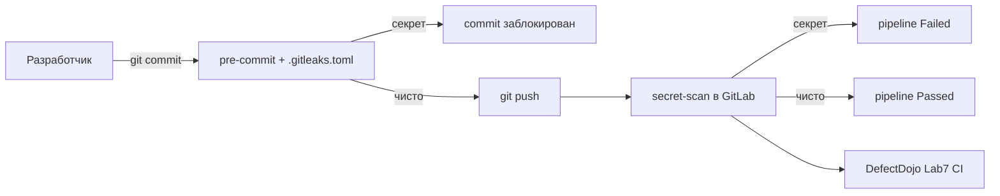
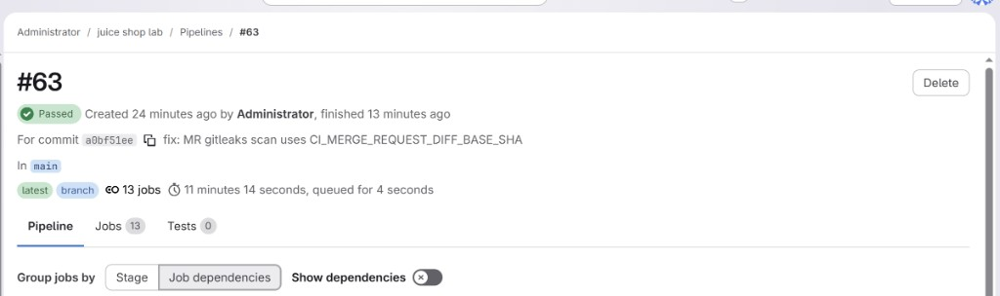
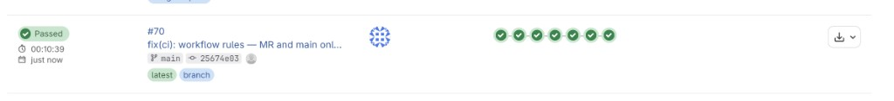
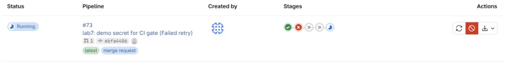
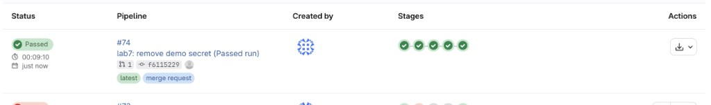

# Лабораторная работа №7

## Поиск и хранение секретов: OWASP Juice Shop

**ФИО:** Трюх Екатерина Александровна · **Группа:** М09КИИ-25  
**Объект:** OWASP Juice Shop 17.0.0 · **Папка:** `juice-shop/`  
**GitLab:** http://10.0.0.10/root/juice-shop-lab · **DefectDojo:** http://10.0.0.20:8080  
**Инструмент:** Gitleaks v8.18.4 · **Дата:** 21.05.2026

**Сдача:** базовая часть (2 балла) — pre-commit + Gitleaks CI + Security Gate + DefectDojo.  
**Доп. задание Vault:** не выполнено.

**Pipelines (итог):** [#63](http://10.0.0.10/root/juice-shop-lab/-/pipelines/63) · [#70](http://10.0.0.10/root/juice-shop-lab/-/pipelines/70) Passed (`main`) · [#73](http://10.0.0.10/root/juice-shop-lab/-/pipelines/73) Failed · [#74](http://10.0.0.10/root/juice-shop-lab/-/pipelines/74) Passed (MR) · [MR !1](http://10.0.0.10/root/juice-shop-lab/-/merge_requests/1) — закрыть без merge

---

## Цель

Научиться **не пускать пароли и ключи в Git**: проверка на компе перед commit, проверка на GitLab при push/MR, отчёт в DefectDojo. Если секрет найден — commit или pipeline **блокируется** (Security Gate).

---

## Схема (что где лежит)



---

## Шаг 1. Разобрали, какие секреты есть в Juice Shop

Juice Shop — учебное приложение, в нём **намеренно** лежат секреты (часть CTF). Мы нашли 4 типа:

1. **RSA private key** — в `lib/insecurity.ts` (подпись JWT)
2. **TOTP secret** — в `data/static/users.yml` (2FA)
3. **JWT_SECRET=...** — в `.env` или конфигах (наш demo-файл)
4. **Google OAuth clientId** — в `config/default.yml`

Эти старые учебные секреты **не считаем новой утечкой** — для них сделали allowlist в `.gitleaks.toml`.  
Для демонстрации gate создали отдельный файл `lab7-secrets-demo.txt` с фейковым `JWT_SECRET=...` (не настоящий ключ).

---

## Шаг 2. Файл `.gitleaks.toml` — правила «что искать»

**Зачем:** один конфиг для pre-commit на ПК и для CI на GitLab. Gitleaks по этим правилам ищет строки, похожие на секреты.

**Файл `juice-shop/.gitleaks.toml`:**

```toml
# Lab 7 — OWASP Juice Shop secret scanning policy
title = "Juice Shop Lab 7"

[extend]
useDefault = true

[[rules]]
id = "juice-shop-rsa-private-key"
description = "RSA private key in source (JWT signing)"
regex = '''-----BEGIN (RSA )?PRIVATE KEY-----'''
keywords = ["BEGIN RSA PRIVATE KEY", "BEGIN PRIVATE KEY"]

[[rules]]
id = "juice-shop-totp-secret"
description = "TOTP/2FA secret in user YAML"
regex = '''(?i)totpSecret:\s*['"]?[A-Z2-7]{16,}'''
keywords = ["totpSecret"]

[[rules]]
id = "juice-shop-jwt-env"
description = "JWT signing secret in config or env-style assignment"
regex = '''(?i)(jwt[_-]?secret)\s*[:=]\s*['"]?[A-Za-z0-9+/=_-]{16,}'''
keywords = ["jwt_secret", "JWT_SECRET"]

[[rules]]
id = "juice-shop-oauth-client-id"
description = "Google OAuth clientId in Juice Shop config"
regex = '''(?i)clientId:\s*['"]?\d{12}-[a-z0-9]+\.apps\.googleusercontent\.com'''
keywords = ["clientId", "googleOauth"]

# Known OWASP CTF secrets — not new leaks; document in lab report
[allowlist]
paths = [
  '''lib/insecurity\.ts''',
  '''data/static/users\.yml''',
  '''encryptionkeys/''',
  '''config/default\.yml''',
]
```

---

## Шаг 3. Файл `.pre-commit-config.yaml` — проверка перед каждым commit

**Зачем:** запускает Gitleaks **автоматически** каждый раз, когда делаешь `git commit`. Секрет в staged-файлах → commit не создаётся.

**Файл `juice-shop/.pre-commit-config.yaml`:**

```yaml
# Lab 7 — local secret scanning (Gitleaks)
repos:
  - repo: https://github.com/gitleaks/gitleaks
    rev: v8.18.4
    hooks:
      - id: gitleaks
        args: [--config, .gitleaks.toml, --redact]
```

---

## Шаг 4. Установка pre-commit на ПК

**Зачем:** без `pre-commit install` хук не активируется — проверка при commit не будет работать.

**Команды:**

```powershell
cd juice-shop
pip install pre-commit
pre-commit install
```

**Вывод:**

```text
Successfully installed pre-commit-...
pre-commit installed at .git\hooks\pre-commit
```

---

## Шаг 5. Демо локально — секрет найден, commit заблокирован

**Зачем:** показать, что pre-commit реально ловит секрет до попадания в Git.

**Команды:**

```powershell
echo 'JWT_SECRET=s3cr3t_test_value_lab7_demo_1234567890' | Out-File -Encoding utf8 lab7-secrets-demo.txt
git add lab7-secrets-demo.txt
git commit -m "test lab7 secret"
```

**Вывод:**

```text
Detect hardcoded secrets.................................................Failed
- hook id: gitleaks
- exit code: 1

Finding:     REDACTED=s3cr3t_test_value_lab7_demo_1234567890
RuleID:      juice-shop-jwt-env
File:        lab7-secrets-demo.txt
Line:        1
Fingerprint: lab7-secrets-demo.txt:juice-shop-jwt-env:1

INF 1 commits scanned.
WRN leaks found: 1
```

Коммит **не создан** — хук вернул exit code 1.

---

## Шаг 6. Демо локально — секрет удалён, проверка прошла

**Зачем:** показать, что после исправления commit снова разрешён.

**Команды:**

```powershell
Remove-Item lab7-secrets-demo.txt -Force
git reset HEAD lab7-secrets-demo.txt 2>$null
pre-commit run gitleaks --all-files
```

**Вывод:**

```text
Detect hardcoded secrets.................................................Passed
```

---

## Шаг 7. Файл `ci/lab7-gitleaks-ci.sh` — скрипт для GitLab CI

**Зачем:** в CI Gitleaks сканирует **только новые коммиты** (push или diff MR), а не всю историю Juice Shop — иначе срабатывал бы на старые CTF-секреты.

**Файл `juice-shop/ci/lab7-gitleaks-ci.sh`:**

```sh
#!/bin/sh
# Lab 7 — scan only new commits in pipeline (not entire Juice Shop history)
set -e
gitleaks version

if [ -n "$CI_MERGE_REQUEST_IID" ]; then
  MR_BASE="${CI_MERGE_REQUEST_DIFF_BASE_SHA:-}"
  if [ -z "$MR_BASE" ]; then
    LOG_OPTS="-1"
    echo "Gitleaks MR scan: last commit only (no diff base)"
  else
    LOG_OPTS="${MR_BASE}..${CI_COMMIT_SHA}"
    echo "Gitleaks MR scan: $LOG_OPTS"
  fi
elif [ "$CI_COMMIT_BEFORE_SHA" = "0000000000000000000000000000000000000000" ] || [ -z "$CI_COMMIT_BEFORE_SHA" ]; then
  LOG_OPTS="-1"
  echo "Gitleaks scan: last commit only (-1)"
else
  LOG_OPTS="${CI_COMMIT_BEFORE_SHA}..${CI_COMMIT_SHA}"
  echo "Gitleaks push scan: $LOG_OPTS"
fi

gitleaks detect \
  --source . \
  --config .gitleaks.toml \
  --redact \
  --log-opts="$LOG_OPTS" \
  --report-format json \
  --report-path gitleaks-report.json \
  --exit-code 1

test -s gitleaks-report.json
```

---

## Шаг 8. Jobs в `.gitlab-ci.yml` — проверка на сервере

**Зачем:** pre-commit можно обойти (`git commit --no-verify`), поэтому нужна **вторая линия** — job `secret-scan` в GitLab. Если секрет найден → pipeline **Failed**, сборка не считается успешной.

### 8.1. Job `secret-scan`

**Фрагмент `juice-shop/.gitlab-ci.yml`:**

```yaml
secret-scan:
  stage: pre-build
  image:
    name: $GITLEAKS_IMAGE
    entrypoint: [""]
  variables:
    GIT_DEPTH: "0"
  dependencies: []
  before_script:
    - chmod +x ci/lab7-gitleaks-ci.sh
  script:
    - sh ci/lab7-gitleaks-ci.sh
  artifacts:
    when: always
    expire_in: 1 week
    paths:
      - gitleaks-report.json
  allow_failure: false
  rules:
    - if: '$CI_PIPELINE_SOURCE == "merge_request_event"'
    - if: '$CI_COMMIT_BRANCH == $CI_DEFAULT_BRANCH'
```

`allow_failure: false` — это **Security Gate**: pipeline падает, если есть секрет.

### 8.2. Fix `workflow` — только MR и main

**Зачем:** раньше push в feature-ветку создавал второй pipeline, GitLab **отменял** MR-pipeline (Canceled вместо Failed). После fix — один pipeline на MR.

**Фрагмент `juice-shop/.gitlab-ci.yml`:**

```yaml
workflow:
  rules:
    - if: '$CI_PIPELINE_SOURCE == "merge_request_event"'
    - if: '$CI_COMMIT_BRANCH == $CI_DEFAULT_BRANCH'
    - if: '$CI_PIPELINE_SOURCE == "schedule"'
    - if: '$RUN_ZAP_FULL == "true"'
    - when: never
```

### 8.3. Job `defectdojo-import-gitleaks`

**Зачем:** отправляет `gitleaks-report.json` в DefectDojo — чтобы препод и команда видели находки в одном месте (как npm audit, Semgrep, ZAP из лаб 4–6).

**Фрагмент `juice-shop/.gitlab-ci.yml`:**

```yaml
defectdojo-import-gitleaks:
  stage: .post
  image: curlimages/curl:latest
  when: always
  needs:
    - job: defectdojo-init
      artifacts: true
    - job: secret-scan
      artifacts: true
      optional: true
  script:
    - |
      # ... curl POST scan_type=Gitleaks Scan, file=gitleaks-report.json
```

Job `defectdojo-init` создаёт engagement с именем **`Lab7 CI ${CI_PIPELINE_ID}`** (например, Lab7 CI 63).

---

## Шаг 9. Push конфигурации Lab 7 на GitLab

**Зачем:** залить все файлы из шагов 2–8 на стенд курса.

**Команда:**

```powershell
git push origin main
```

**Вывод:**

```text
To http://10.0.0.10/root/juice-shop-lab.git
   8895e52cd..a0bf51ee163331eb29086895163669c1eed071d4  main -> main
```

**Результат в GitLab:** pipeline **#63 Passed** — http://10.0.0.10/root/juice-shop-lab/-/pipelines/63  
Commit: `a0bf51ee`, ветка `main`, job `secret-scan` — Passed.

**Фрагмент лога job `secret-scan` (чистый прогон):**

```text
Gitleaks scan: last commit only (-1)
...
WRN leaks found: 0
Job succeeded
```

**Результат в DefectDojo:** engagement **Lab7 CI 63**, test type Gitleaks Scan, 0 новых findings.

---

## Шаг 10. Демо Security Gate на MR — pipeline Failed

**Зачем:** показать, что CI на сервере тоже блокирует секрет (не только pre-commit на ПК).

**Действия:** MR !1, ветка `lab7-demo-gate` → `main` (не мержить!).  
Push файла `lab7-secrets-demo.txt` с `JWT_SECRET=...`, commit `ebfa4406`.

**Ссылка:** http://10.0.0.10/root/juice-shop-lab/-/merge_requests/1

**Результат в GitLab:** pipeline **#73 Failed** — http://10.0.0.10/root/juice-shop-lab/-/pipelines/73

**Фрагмент лога job `secret-scan` (с секретом):**

```text
Gitleaks MR scan: <base>..ebfa4406
...
RuleID:      juice-shop-jwt-env
File:        lab7-secrets-demo.txt
Line:        1
WRN leaks found: 1
ERROR: Job failed: exit code 1
```

**Результат в DefectDojo:** engagement **Lab7 CI 73**, finding — hard-coded JWT, severity High, CWE-798.

---

## Шаг 11. Удаление demo — pipeline Passed

**Зачем:** показать, что после исправления gate снова пропускает код.

**Действия:** удалить `lab7-secrets-demo.txt`, push commit `f61152292`.

**Результат в GitLab:** pipeline [**#74 Passed**](http://10.0.0.10/root/juice-shop-lab/-/pipelines/74) — 9 min 10 s, 5 stages, merge request, commit `f61152292`.

**Фрагмент лога job `secret-scan`:**

```text
Gitleaks MR scan: <base>..f61152292
...
WRN leaks found: 0
Job succeeded
```

**Результат в DefectDojo:** engagement **Lab7 CI 74**, Gitleaks Scan — 0 новых findings.

---

## Шаг 12. Повторная проверка локально

**Команда:**

```powershell
cd juice-shop
pre-commit run gitleaks --all-files
```

**Вывод:**

```text
Detect hardcoded secrets.................................................Passed
```

---

## Vault (доп. задание — не выполнено)

По методичке: HashiCorp Vault для хранения секретов **вне Git**. Не реализовано (+2 балла не заявляются).

---

## Выводы

1. Два уровня защиты: **pre-commit** на ПК и **secret-scan** в GitLab CI.
2. Один конфиг `.gitleaks.toml` — 4 своих правила + allowlist для учебных CTF-файлов Juice Shop.
3. Demo `JWT_SECRET=...` блокируется локально и в CI: MR !1 — **#73 Failed**, после удаления — **#74 Passed**.
4. Отчёты в **DefectDojo**: Lab7 CI 63, Lab7 CI 73 (finding JWT), Lab7 CI 74 (чисто).
5. Pre-commit можно обойти `--no-verify` — поэтому серверный gate обязателен.

---

## Приложение — скриншоты GitLab (для PDF)

Файлы: `lab_report_7_screenshots/`

### Pipeline #63 Passed (`main`, Lab 7)



### Pipeline #70 Passed (`main`, workflow fix)



### Pipeline #73 Failed (MR, Security Gate)



### Pipelines #73 Failed и #74 Passed (MR)



### DefectDojo

Engagements вручную на http://10.0.0.20:8080 — Product **OWASP Juice Shop**:

- **Lab7 CI 63** — 0 Gitleaks findings (после #63)
- **Lab7 CI 73** — finding `juice-shop-jwt-env` (после #73 Failed)
- **Lab7 CI 74** — 0 новых findings (после #74 Passed)

*(Скрин engagement/finding — вставить в PDF при экспорте, если кафедра требует.)*

---

## Чеклист перед сдачей

- [x] `.gitleaks.toml` + `.pre-commit-config.yaml` + `pre-commit install`
- [x] Демо pre-commit: Fail → Pass (шаги 5–6)
- [x] `secret-scan` + `defectdojo-import-gitleaks` в CI
- [x] Pipeline #63, #70 Passed на `main`
- [x] Pipeline #73 Failed, #74 Passed на MR !1
- [x] Скриншоты GitLab в `lab_report_7_screenshots/` и в отчёте выше
- [x] MR !1: push с `merge_request.close` (commit `ce4797926`) — проверить статус **Closed** в GitLab
- [ ] DefectDojo — скрин finding (опционально для PDF)
- [ ] Vault (опционально, +2 балла)
- [ ] Экспорт PDF по ГОСТ (если требует кафедра)
